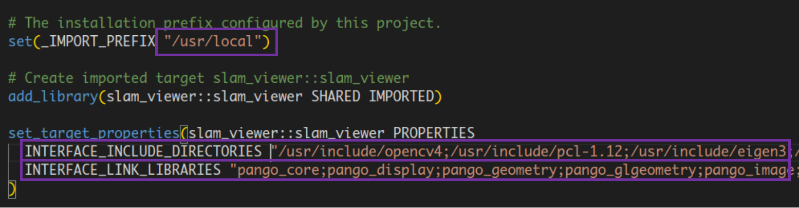

## 背景

我觉得所有学习过某种编程语言的人，或多或少都希望自己构建一个可使用**标准化流程**安装的三方库。当然我也不例外，我平时的大部分精力都会放在SLAM的学习上，我的想法是做一个简单方便的SLAM可视化小工具，用来帮助自己快速验证一个SLAM算法的效果和可行性。几个月前，我确实把一个名为[SLAM_VIEWER](https://github.com/sunshanlu/SLAM_VIEWER)的小工具开源了出来。为了方便自己也是为了方便大家的使用，我希望我写的三方库可以像主流的三方库一样，能够使用一个**标准化的编译和安装**流程，并能够在cmake中很方便地导入使用。在我查阅了cmake官方文档并奴役了许多AI后，得到了一套流程化的解决方案：

## 解决方案

```cmake

# CMakeLists.txt

cmake_minimum_required(VERSION 3.5)

project(slam_viewer VERSION 0.0.2)

set(CMAKE_CXX_STANDARD 17)
set(CMAKE_CXX_STANDARD_REQUIRED ON)
if(NOT CMAKE_BUILD_TYPE)
    set(CMAKE_BUILD_TYPE Release)
endif()

if(NOT DEFINED BUILD_EXAMPLES)
    set(BUILD_EXAMPLES ON)
endif()

find_package(Pangolin REQUIRED)
find_package(Sophus REQUIRED)
find_package(PCL REQUIRED)
find_package(TBB REQUIRED)
find_package(OpenCV REQUIRED)
find_package(Eigen3 REQUIRED)

set(CMAKE_RUNTIME_OUTPUT_DIRECTORY ${CMAKE_CURRENT_SOURCE_DIR}/bin)
set(CMAKE_LIBRARY_OUTPUT_DIRECTORY ${CMAKE_CURRENT_SOURCE_DIR}/lib)
set(CMAKE_ARCHIVE_OUTPUT_DIRECTORY ${CMAKE_CURRENT_SOURCE_DIR}/lib)
set(PACKAGE_INCLUDE_INSTALL_DIR ${CMAKE_INSTALL_PREFIX}/include)
set(PACKAGE_LIBS_INSTALL_DIR ${CMAKE_INSTALL_PREFIX}/lib)

include_directories(${CMAKE_CURRENT_SOURCE_DIR}/include)

file(GLOB SRC_FILES ${CMAKE_CURRENT_SOURCE_DIR}/src/*.cc)

add_library(slam_viewer SHARED ${SRC_FILES})
target_link_libraries(
    slam_viewer PUBLIC ${Pangolin_LIBRARY} ${PCL_LIBRARIES} Sophus::Sophus
                       TBB::tbb ${OpenCV_LIBS} Eigen3::Eigen)
target_include_directories(
    slam_viewer PUBLIC ${OpenCV_INCLUDE_DIRS} ${PCL_INCLUDE_DIRS}
                       $<BUILD_INTERFACE:${CMAKE_CURRENT_SOURCE_DIR}/include>
                       $<INSTALL_INTERFACE:include>)

if(${BUILD_EXAMPLES})
    add_subdirectory(examples)
endif()

# 添加安装指令
install(
    TARGETS slam_viewer
    EXPORT ${PROJECT_NAME}Targets
    LIBRARY DESTINATION ${PACKAGE_LIBS_INSTALL_DIR}
    ARCHIVE DESTINATION ${PACKAGE_LIBS_INSTALL_DIR})
install(DIRECTORY ${PROJECT_SOURCE_DIR}/include/slam_viewer
        DESTINATION ${PACKAGE_INCLUDE_INSTALL_DIR})

# 安装导出文件
install(
    EXPORT ${PROJECT_NAME}Targets
    FILE ${PROJECT_NAME}Targets.cmake
    NAMESPACE ${PROJECT_NAME}::
    DESTINATION ${CMAKE_INSTALL_PREFIX}/lib/cmake/${PROJECT_NAME})

# 生成并安装Config文件
include(CMakePackageConfigHelpers)
write_basic_package_version_file(
    ${PROJECT_BINARY_DIR}/${PROJECT_NAME}ConfigVersion.cmake
    VERSION ${PROJECT_VERSION}
    COMPATIBILITY SameMajorVersion)

configure_file(Config.cmake.in
               "${PROJECT_BINARY_DIR}/${PROJECT_NAME}Config.cmake" @ONLY)

install(FILES ${PROJECT_BINARY_DIR}/${PROJECT_NAME}Config.cmake
              ${PROJECT_BINARY_DIR}/${PROJECT_NAME}ConfigVersion.cmake
        DESTINATION ${CMAKE_INSTALL_PREFIX}/lib/cmake/${PROJECT_NAME})

# 输出配置信息，以查看是否配置正确
message(====================================================================)
message(STATUS ${PROJECT_NAME} Configure:)
message(STATUS CMAKE_BUILD_TYPE: ${CMAKE_BUILD_TYPE})
message(STATUS BUILD_EXAMPLES: ${BUILD_EXAMPLES})
message(STATUS CMAKE_INSTALL_PREFIX: ${CMAKE_INSTALL_PREFIX})
message(====================================================================)

```

上面的cmake代码是我根据这一套流程配置的slam_viewer库，其主要涵盖以下几个方面的内容：

### 1. 安装Targets和头文件目录

```cmake
install(TARGETS slam_viewer
        EXPORT ${PROJECT_NAME}Targets
        LIBRARY DESTINATION ${PACKAGE_LIBS_INSTALL_DIR}
        ARCHIVE DESTINATION ${PACKAGE_LIBS_INSTALL_DIR})
install(DIRECTORY ${PROJECT_SOURCE_DIR}/include/slam_viewer
        DESTINATION ${PACKAGE_INCLUDE_INSTALL_DIR})
```

`install`是`cmake`中比较常用的一个命令，其作用主要是将某个**文件夹**，**某个文件**或者**某些Target**安装到指定的位置。如果你需要安装的是某个目录，就需要使用`DIRECTORY`关键字，并在后面跟上待文件夹的位置，然后使用`DESTINATION`关键字来指定安装的位置。在标准工作流程里面，使用安装文件夹的命令，将头文件目录安装到`${PACKAGE_INCLUDE_INSTALL_DIR}`位置，其中`${PACKAGE_INCLUDE_INSTALL_DIR}`=`${CMAKE_INSTALL_PREFIX}/include`，如果不指定`CMAKE_INSTALL_PREFIX`的话，默认为`/usr/local`。


使用`install`将`TARGETS`安装到某个位置时就比较繁琐了，首先需要指定`TARGETS`关键字，并在后面跟上需要安装的`target`的名称（在`cmake`中，可执行文件，库文件都是以`TARGET`的形式维护）。`EXPORT`关键字代表需要生成一个`TARGETS`相关的依赖文件，这个依赖文件就是`${PROJECT_NAME}Targets.cmake`。里面维护了`TARGETS`中的依赖关系，主要有两个内容，一个是`INTERFACE_LINK_LIBRARIES`，另一个是`INTERFACE_INCLUDE_DIRECTORIES`。


- `INTERFACE_LINK_LIBRARIES`维护的是`TARGET`所有依赖的动态库的`TARGET`名字，这部分是通过解析`target_link_libraries`指令内容生成的。
- `INTERFACE_INCLUDE_DIRECTORIES`维护的是`TARGET`所有依赖的头文件的路径，这部分是通过解析`target_include_directories`指令内容生成的。
- 当然，只有使用`PUBLIC`和`INTERFACE`关键字指定的依赖才会被解析并放在`INTERFACE_LINK_LIBRARIES`和`INTERFACE_INCLUDE_DIRECTORIES`中。
- 这里并不会对`PUBLIC`、`INTERFACE`和`PRIVATE`关键字进行解析，网上也有很多这方面的资料可以参考。

下面是`slam_viewerTargets.cmake`文件的部分截图，这部分内容相当**重要**，或者中可以通过这个`xxxTargets.cmake`文件来找到三方库的`Target`信息，并且可以明确这个`Target`的依赖关系。

<div align="center">
    
</div>

### 2. 安装导出的Target依赖文件到指定位置

```cmake
install(EXPORT ${PROJECT_NAME}Targets
        FILE ${PROJECT_NAME}Targets.cmake
        NAMESPACE ${PROJECT_NAME}::
        DESTINATION ${CMAKE_INSTALL_PREFIX}/lib/cmake/${PROJECT_NAME})
```

这一步主要是为了将`Target`的依赖文件和`slam_viewerConfig.cmake`文件导出到同一目录下方便`slam_viewerConfig.cmake`文件的引用`include()`操作。根据[`cmake`官方文档](https://cmake.org/cmake/help/latest/command/install.html#export)部分的说明，安装`TARGET`的依赖文件必须使用带有`EXPORT`关键字的安装命令，并且`EXPORT`关键字后面与安装`TARGETS`的`EXPORT`关键字后面的内容保持一致，`FILE`关键字后指定安装文件的文件名。`NAMESPACE`关键字是一个可选的参数，如果带有`NAMESPACE`，那么在其他依赖当前编译的三方库文件时，就需要在`Target`名字前指定命名空间，在上面`slam_viewerTargets.cmake`文件的部分截图中也能体现。在一定程度上，可以防止同名`TARGET`的出现。

### 3. 生成并安装配置文件

```cmake
include(CMakePackageConfigHelpers)
write_basic_package_version_file(
    ${PROJECT_BINARY_DIR}/${PROJECT_NAME}ConfigVersion.cmake
    VERSION ${PROJECT_VERSION}
    COMPATIBILITY SameMajorVersion)

configure_file(Config.cmake.in "${PROJECT_BINARY_DIR}/${PROJECT_NAME}Config.cmake" @ONLY)

install(FILES ${PROJECT_BINARY_DIR}/${PROJECT_NAME}Config.cmake
              ${PROJECT_BINARY_DIR}/${PROJECT_NAME}ConfigVersion.cmake
        DESTINATION ${CMAKE_INSTALL_PREFIX}/lib/cmake/${PROJECT_NAME})
```

首先需要引入`CMakePackageConfigHelpers`模块，需要这个模块的`write_basic_package_version_file`函数来写版本配置文件`xxxConfigVersion.cmake`。其中`VERSION`关键字后面跟项目版本号，`COMPATIBILITY`关键字后面指定版本兼容信息，这里的版本兼容性可以为后续`find_package`提供信息。一共有`AnyNewerVersion`|`SameMajorVersion`|`SameMinorVersion`|`ExactVersion`这四种版本兼容要求，其详细的内容解释可以看[`cmake`文档](https://cmake.org/cmake/help/latest/module/CMakePackageConfigHelpers.html#command:write_basic_package_version_file)。

`configure_file`函数配置`xxxConfig.cmake`文件，当我们使用`find_pacakge(xxx)`函数来查找`xxx`三方库时，`find_package`函数会试图找到一个`xxxConfig.cmake`或`xxxConfigVersion.cmake`文件来判断是否找到了`xxx`库。代码中`Config.cmake.in`为配置`source`文件路径，而`"${PROJECT_BINARY_DIR}/${PROJECT_NAME}Config.cmake"`为配置`target`文件路径，其中`@ONLY`限定了替换的变量只能用`@`符号包裹起来。`configure_file`函数的一些实例内容解释可以看[`cmake`文档](https://cmake.org/cmake/help/latest/command/configure_file.html)。

最后安装`xxxConfig.cmake`和`xxxConfigVersion.cmake`文件到指定位置即可。这个位置**建议**和`xxxTargets.cmake`的安装位置保持一致。

### 4. 配置Config.cmake.in文件

```cmake
# Config.cmake.in

include(CMakeFindDependencyMacro)

find_dependency(Pangolin REQUIRED)
find_dependency(Sophus REQUIRED)
find_dependency(PCL REQUIRED)
find_dependency(TBB REQUIRED)
find_dependency(OpenCV REQUIRED)
find_dependency(Eigen3 REQUIRED)

include("${CMAKE_CURRENT_LIST_DIR}/@PROJECT_NAME@Targets.cmake")
```

最后需要配置`Config.cmake.in`文件，在第3步中，`configure_file`函数将`Config.cmake.in`文件配置到`${PROJECT_BINARY_DIR}/${PROJECT_NAME}Config.cmake`文件中，其中`@PROJECT_NAME@`为`PROJECT_NAME`变量，`${CMAKE_CURRENT_LIST_DIR}`为当前`xxxConfig.cmake`文件所在的目录。也就是为什么第3步的结尾建议要和`xxxTargets.cmake`的安装装位置保持一致，如果不一致，这里`include()`参数路径就需要更改。

除此之外，还需要对自定义的三方库依赖的三方库进行配置，这里需要使用`find_dependency`函数，而`find_dependency`函数在模块`CMakeFindDependencyMacro`中定义。配置好`find_dependency`后，当其他库文件或者可执行文件依赖当前定义的库文件时，就不需要对自定义的三方库依赖的三方库进行`find_package`操作了。

### 5. 配置依赖自身的头文件路径的INTERFACE_INCLUDE_DIRECTORIES

```cmake
target_include_directories(
    slam_viewer PUBLIC ${OpenCV_INCLUDE_DIRS} ${PCL_INCLUDE_DIRS}
    $<BUILD_INTERFACE:${CMAKE_CURRENT_SOURCE_DIR}/include>
    $<INSTALL_INTERFACE:include>
)
```

在讲解这里的用法之前，我们需要理清楚一个比较重要的问题：

在源码中可以看到，对某些库文件，没有使用`include_directories`或者`target_include_directories`明确指定它们的头文件路径，而有些库像`OpenCV`和`PCL`都需要在`CMakeLists.txt`中**明确指定**头文件路径。在第一部分讲到，如果你在`target_include_directories`中指定了某些头文件路径，那么在导出的含有依赖关系的文件`xxxTargets.cmake`中会有一个`INTERFACE_INCLUDE_DIRECTORIES`，这里会维护这个`Target`依赖的头文件路径。当某些库严格按照`target_include_directories`来维护`Target`的依赖关系时，导出的`xxxTargets.cmake`文件中必然保存着该`Target`依赖的所有头文件路径，因此这种库只需要使用`target_link_libraries`函数即可搞定头文件依赖和库文件依赖关系。然而总有些三方库因为这样或者那样的原因，选择不使用`target_include_directories`来维护头文件依赖关系，这种库往往都会提供一个`xxx_INCLUDE_DIRS`这个变量，供调用者使用，因此遇到这种三方库依赖时，需要将`target_include_directories`来单独维护这份头文件依赖，然后导入到自身的`INTERFACE_INCLUDE_DIRECTORIES`中。

我相信通过上面一段阐述的内容，同学们应该能理解为什么`OpenCV`和`PCL`库需要单独使用`target_include_directories`来维护头文件依赖关系，而其他库则不需要。除此之外，`$<BUILD_INTERFACE:${CMAKE_CURRENT_SOURCE_DIR}/include>`和`$<INSTALL_INTERFACE:include>`这两个内容应该吸引了你的注意。根据[`cmake`官方文档](https://cmake.org/cmake/help/latest/command/target_include_directories.html#target-include-directories)的解释，以`$<BUILD_INTERFACE:`开头的内容是声明构建过程中所需要的头文件依赖关系，并且后面需要跟绝对路径，而以`$<INSTALL_INTERFACE:`开头的内容则是安装过程中的头文件依赖或者使用的头文件依赖，后面需要跟以`${CMAKE_INSTALL_PREFIX}$`为前缀的**相对路径**。在`xxxTargets.cmake`中会忽略`$<BUILD_INTERFACE:`开头的头文件依赖。而没有`$<`开头的`CMAKE`会认定这种头文件依赖发生在编译和安装使用过程，因此也会在`xxxTargets.cmake`中保存下来。

### 6. 如何使用？

根据上面的解释，我们不难理解所有的库文件依赖关系都在`xxxTargets.cmake`维护的`INTERFACE_LINK_LIBRARIES`中，而所有的头文件依赖关系都在`xxxTargets.cmake`维护的`INTERFACE_INCLUDE_DIRECTORIES`中，而在`xxxConfig.cmake`中使用`find_dependency`代替了`find_package`函数来导入依赖库文件的`Target`。因此使用自定义的`slam_viewer`库时，只需要使用下面的两行代码就可以搞定，可以说非常的简单：

```cmake
# your project CMakeLists.txt

find_package(slam_viewer REQUIRED)

target_link_libraries(<your_target> slam_viewer::slam_viewer)
```

!!! important "标准流程？"
    上面的内容，是我自己在看了网上的教程和一些通用三方库的CMakeLists.txt总结来的一套适合我自己使用的建库流程，当然这并不是唯一的建库方法。[`cmake`官方教程](https://cmake.org/cmake/help/latest/guide/tutorial/index.html)的`step9`-`step11`也是非常好的建库流程。我想说的是，无论使用什么样的方式，只要能实现一般三方库导入项目的功能，就是一个好的标准流程。我也非常希望我写的东西能对你有所帮助。